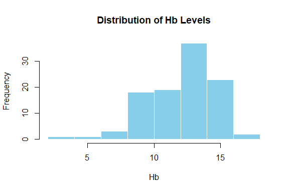
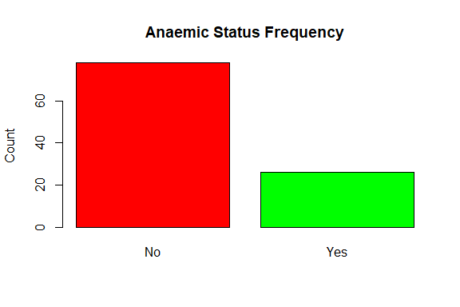
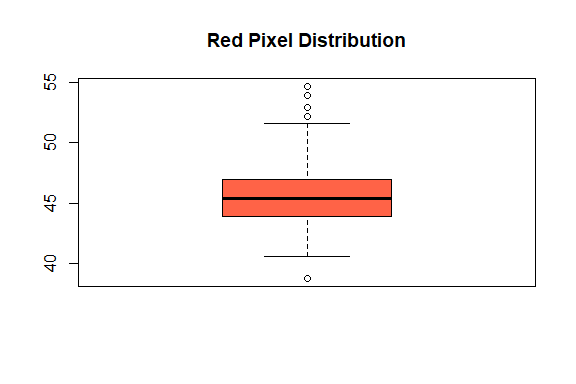
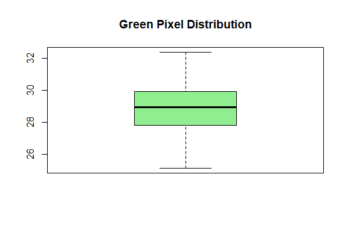
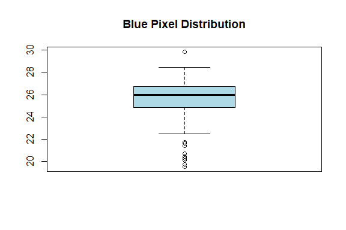
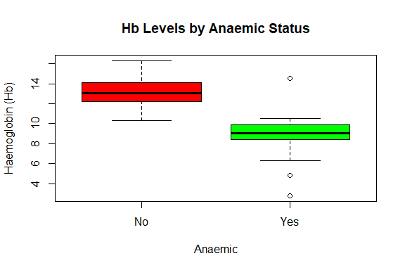
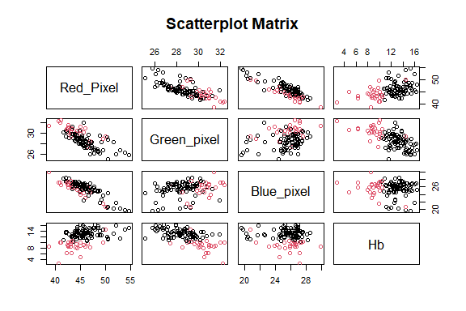
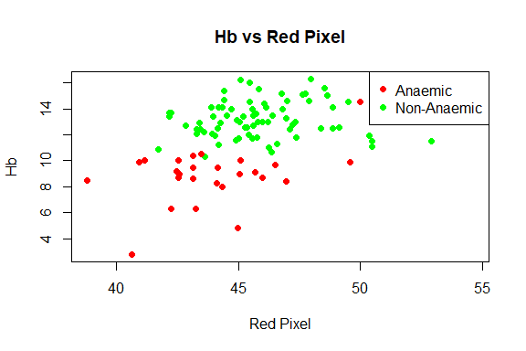

Anaemia Prediction
================
Trevor Okinda
2024

- [Student Details](#student-details)
- [Setup Chunk](#setup-chunk)
  - [Source:](#source)
  - [Reference:](#reference)
- [Understanding the Dataset (Exploratory Data Analysis
  (EDA))](#understanding-the-dataset-exploratory-data-analysis-eda)
  - [Loading the Dataset](#loading-the-dataset)
  - [Measures of Frequency](#measures-of-frequency)
  - [Measures of Central Tendency](#measures-of-central-tendency)
  - [Measures of Distribution](#measures-of-distribution)
  - [Measures of Relationship](#measures-of-relationship)
  - [ANOVA](#anova)
  - [Plots](#plots)
- [Preprocessing and Data
  Transformation](#preprocessing-and-data-transformation)
  - [Missing Values](#missing-values)
- [Training Model](#training-model)
  - [Data Splitting](#data-splitting)
  - [Bootstrapping](#bootstrapping)
  - [Cross-validation](#cross-validation)
  - [Training Different Models](#training-different-models)
  - [Performance Comparison](#performance-comparison)
  - [Saving Model](#saving-model)

# Student Details

|                       |                    |
|-----------------------|--------------------|
| **Student ID Number** | 134780             |
| **Student Name**      | Trevor Okinda      |
| **BBIT 4.2 Group**    | C                  |
| **Project Name**      | Anaemia Prediction |

# Setup Chunk

**Note:** the following KnitR options have been set as the global
defaults: <BR>
`knitr::opts_chunk$set(echo = TRUE, warning = FALSE, eval = TRUE, collapse = FALSE, tidy = TRUE)`.

More KnitR options are documented here
<https://bookdown.org/yihui/rmarkdown-cookbook/chunk-options.html> and
here <https://yihui.org/knitr/options/>.

### Source:

The dataset that was used can be downloaded here: *\<<a
href="https://www.kaggle.com/datasets/shahriar26s/anemia-detection-dataset/data\"
class="uri">https://www.kaggle.com/datasets/shahriar26s/anemia-detection-dataset/data\</a>\>*

### Reference:

*\<Shahriar26s. (2025). Anemia Detection Dataset. Kaggle. <a
href="https://www.kaggle.com/datasets/shahriar26s/anemia-detection-dataset\"
class="uri">https://www.kaggle.com/datasets/shahriar26s/anemia-detection-dataset\</a>\>  
Refer to the APA 7th edition manual for rules on how to cite datasets:
<https://apastyle.apa.org/style-grammar-guidelines/references/examples/data-set-references>*

# Understanding the Dataset (Exploratory Data Analysis (EDA))

## Loading the Dataset

``` r
# Load anaemia dataset with appropriate column types
AnaemiaData <- read.csv("anemia_dataset.csv", colClasses = c(
  Red_Pixel = "numeric",
  Green_pixel = "numeric",
  Blue_pixel = "numeric",
  Hb = "numeric",           # Haemoglobin levels
  Anaemic = "factor"        # Yes or No (classification target)
))

# View the structure of the dataset
str(AnaemiaData)
```

    ## 'data.frame':    104 obs. of  5 variables:
    ##  $ Red_Pixel  : num  43.3 45.6 45 44.5 43.3 ...
    ##  $ Green_pixel: num  30.8 28.2 29 29 30.7 ...
    ##  $ Blue_pixel : num  25.9 26.2 26 26.5 26 ...
    ##  $ Hb         : num  6.3 13.5 11.7 13.5 12.4 16.2 8.6 10.3 13 9.7 ...
    ##  $ Anaemic    : Factor w/ 2 levels "No","Yes": 2 1 1 1 1 1 2 1 1 2 ...

``` r
# Quick check on data
summary(AnaemiaData)
```

    ##    Red_Pixel      Green_pixel      Blue_pixel          Hb        Anaemic 
    ##  Min.   :38.80   Min.   :25.14   Min.   :19.54   Min.   : 2.80   No :78  
    ##  1st Qu.:43.91   1st Qu.:27.87   1st Qu.:24.90   1st Qu.:10.65   Yes:26  
    ##  Median :45.39   Median :28.95   Median :25.95   Median :12.60           
    ##  Mean   :45.65   Mean   :28.88   Mean   :25.47   Mean   :12.15           
    ##  3rd Qu.:46.97   3rd Qu.:29.89   3rd Qu.:26.72   3rd Qu.:14.00           
    ##  Max.   :54.65   Max.   :32.37   Max.   :29.84   Max.   :16.30

``` r
#View dataset
View(AnaemiaData)
```

## Measures of Frequency

``` r
# Measures of Frequency
# Frequency of the target variable
table(AnaemiaData$Anaemic)
```

    ## 
    ##  No Yes 
    ##  78  26

``` r
# Frequency of Hb ranges (e.g. grouping Hb levels)
cut_Hb <- cut(AnaemiaData$Hb, breaks = c(0, 7, 10, 13, 16, Inf), right = FALSE)
table(cut_Hb)
```

    ## cut_Hb
    ##    [0,7)   [7,10)  [10,13)  [13,16) [16,Inf) 
    ##        4       16       39       41        4

## Measures of Central Tendency

``` r
# Measures of Central Tendency
# Mean
mean(AnaemiaData$Red_Pixel)
```

    ## [1] 45.65418

``` r
mean(AnaemiaData$Green_pixel)
```

    ## [1] 28.87551

``` r
mean(AnaemiaData$Blue_pixel)
```

    ## [1] 25.47032

``` r
mean(AnaemiaData$Hb)
```

    ## [1] 12.15096

``` r
# Median
median(AnaemiaData$Red_Pixel)
```

    ## [1] 45.38535

``` r
median(AnaemiaData$Green_pixel)
```

    ## [1] 28.94875

``` r
median(AnaemiaData$Blue_pixel)
```

    ## [1] 25.9532

``` r
median(AnaemiaData$Hb)
```

    ## [1] 12.6

``` r
# Mode function
get_mode <- function(x) {
  ux <- unique(x)
  ux[which.max(tabulate(match(x, ux)))]
}

get_mode(AnaemiaData$Anaemic)
```

    ## [1] No
    ## Levels: No Yes

## Measures of Distribution

``` r
# Measures of Distribution
# Range
range(AnaemiaData$Hb)
```

    ## [1]  2.8 16.3

``` r
# Variance and standard deviation
var(AnaemiaData$Hb)
```

    ## [1] 6.314951

``` r
sd(AnaemiaData$Hb)
```

    ## [1] 2.512957

``` r
# Skewness and kurtosis (requires e1071)
library(e1071)
skewness(AnaemiaData$Hb)
```

    ## [1] -0.9236405

``` r
kurtosis(AnaemiaData$Hb)
```

    ## [1] 1.120267

## Measures of Relationship

``` r
# Measures of Relationship
# Correlation matrix among pixel values and Hb
cor(AnaemiaData[, c("Red_Pixel", "Green_pixel", "Blue_pixel", "Hb")])
```

    ##              Red_Pixel Green_pixel Blue_pixel         Hb
    ## Red_Pixel    1.0000000  -0.7320027 -0.8457644  0.4245860
    ## Green_pixel -0.7320027   1.0000000  0.2555887 -0.6373400
    ## Blue_pixel  -0.8457644   0.2555887  1.0000000 -0.1033727
    ## Hb           0.4245860  -0.6373400 -0.1033727  1.0000000

``` r
# Chi-square test between Anaemic and binned Hb
Hb_group <- cut(AnaemiaData$Hb, breaks = c(0, 10, 12, Inf), labels = c("Low", "Medium", "High"))
chisq.test(table(Hb_group, AnaemiaData$Anaemic))
```

    ## 
    ##  Pearson's Chi-squared test
    ## 
    ## data:  table(Hb_group, AnaemiaData$Anaemic)
    ## X-squared = 89.209, df = 2, p-value < 2.2e-16

## ANOVA

``` r
# One-way ANOVA: Does Hb significantly differ by Anaemic status?
anova_result <- aov(Hb ~ Anaemic, data = AnaemiaData)

# Summary of ANOVA test
summary(anova_result)
```

    ##              Df Sum Sq Mean Sq F value Pr(>F)    
    ## Anaemic       1  382.2   382.2   145.3 <2e-16 ***
    ## Residuals   102  268.3     2.6                   
    ## ---
    ## Signif. codes:  0 '***' 0.001 '**' 0.01 '*' 0.05 '.' 0.1 ' ' 1

``` r
# Tukey HSD post-hoc test
TukeyHSD(anova_result)
```

    ##   Tukey multiple comparisons of means
    ##     95% family-wise confidence level
    ## 
    ## Fit: aov(formula = Hb ~ Anaemic, data = AnaemiaData)
    ## 
    ## $Anaemic
    ##             diff       lwr       upr p adj
    ## Yes-No -4.426923 -5.155395 -3.698452     0

## Plots

``` r
# Histogram for Hb
hist(AnaemiaData$Hb, main = "Distribution of Hb Levels", xlab = "Hb", col = "skyblue", border = "white")
```

<!-- -->

``` r
# Bar plot for Anaemic status
barplot(table(AnaemiaData$Anaemic), main = "Anaemic Status Frequency", col = c("red", "green"), ylab = "Count")
```

<!-- -->

``` r
# Boxplots for pixel values
boxplot(AnaemiaData$Red_Pixel, main = "Red Pixel Distribution", col = "tomato")
```

<!-- -->

``` r
boxplot(AnaemiaData$Green_pixel, main = "Green Pixel Distribution", col = "lightgreen")
```

<!-- -->

``` r
boxplot(AnaemiaData$Blue_pixel, main = "Blue Pixel Distribution", col = "lightblue")
```

<!-- -->

``` r
# Boxplot of Hb by Anaemic status
boxplot(Hb ~ Anaemic, data = AnaemiaData,
        main = "Hb Levels by Anaemic Status", col = c("red", "green"),
        ylab = "Haemoglobin (Hb)")
```

<!-- -->

``` r
# Scatterplot matrix for pixel values and Hb
pairs(AnaemiaData[, c("Red_Pixel", "Green_pixel", "Blue_pixel", "Hb")],
      main = "Scatterplot Matrix", col = AnaemiaData$Anaemic)
```

<!-- -->

``` r
# Colored scatterplot: Hb vs Red_Pixel
plot(AnaemiaData$Red_Pixel, AnaemiaData$Hb,
     col = ifelse(AnaemiaData$Anaemic == "Yes", "red", "green"),
     pch = 19, xlab = "Red Pixel", ylab = "Hb", main = "Hb vs Red Pixel")

legend("topright", legend = c("Anaemic", "Non-Anaemic"),
       col = c("red", "green"), pch = 19)
```

<!-- -->

# Preprocessing and Data Transformation

## Missing Values

``` r
# Check if any missing values exist
any(is.na(AnaemiaData))  # Returns TRUE if any NA is present
```

    ## [1] FALSE

``` r
# Count of missing values per column
colSums(is.na(AnaemiaData))
```

    ##   Red_Pixel Green_pixel  Blue_pixel          Hb     Anaemic 
    ##           0           0           0           0           0

``` r
# Summary to visually inspect data completeness
summary(AnaemiaData)
```

    ##    Red_Pixel      Green_pixel      Blue_pixel          Hb        Anaemic 
    ##  Min.   :38.80   Min.   :25.14   Min.   :19.54   Min.   : 2.80   No :78  
    ##  1st Qu.:43.91   1st Qu.:27.87   1st Qu.:24.90   1st Qu.:10.65   Yes:26  
    ##  Median :45.39   Median :28.95   Median :25.95   Median :12.60           
    ##  Mean   :45.65   Mean   :28.88   Mean   :25.47   Mean   :12.15           
    ##  3rd Qu.:46.97   3rd Qu.:29.89   3rd Qu.:26.72   3rd Qu.:14.00           
    ##  Max.   :54.65   Max.   :32.37   Max.   :29.84   Max.   :16.30

# Training Model

## Data Splitting

``` r
# Load required library
library(caret)
```

    ## Loading required package: ggplot2

    ## Loading required package: lattice

``` r
# Set seed for reproducibility
set.seed(123)

# Create index for 70% training data
train_index <- createDataPartition(AnaemiaData$Anaemic, p = 0.7, list = FALSE)

# Split the data
train_data <- AnaemiaData[train_index, ]
test_data  <- AnaemiaData[-train_index, ]

# Confirm dimensions
cat("Training set rows:", nrow(train_data), "\n")
```

    ## Training set rows: 74

``` r
cat("Testing set rows:", nrow(test_data), "\n")
```

    ## Testing set rows: 30

## Bootstrapping

``` r
# Load required libraries
library(caret)

# Set seed for reproducibility
set.seed(123)

# Define bootstrap control
bootstrap_control <- trainControl(
  method = "boot",
  number = 100,              # 100 bootstrap resamples
  savePredictions = "final",
  classProbs = TRUE,
  summaryFunction = twoClassSummary
)

# Make sure the response variable is a factor with valid levels
train_data$Anaemic <- factor(train_data$Anaemic, levels = c("Yes", "No"))

# Train a logistic regression model with bootstrapping
boot_model <- train(
  Anaemic ~ ., data = train_data,
  method = "glm",
  family = "binomial",
  trControl = bootstrap_control,
  metric = "ROC"
)

# Output model summary
print(boot_model)
```

    ## Generalized Linear Model 
    ## 
    ## 74 samples
    ##  4 predictor
    ##  2 classes: 'Yes', 'No' 
    ## 
    ## No pre-processing
    ## Resampling: Bootstrapped (100 reps) 
    ## Summary of sample sizes: 74, 74, 74, 74, 74, 74, ... 
    ## Resampling results:
    ## 
    ##   ROC        Sens       Spec     
    ##   0.9333134  0.8233669  0.9577609

## Cross-validation

``` r
# Load required library
library(caret)

# Set seed for reproducibility
set.seed(123)

# Define 10-fold cross-validation control
cv_control <- trainControl(
  method = "cv",
  number = 10,
  classProbs = TRUE,
  summaryFunction = twoClassSummary,
  savePredictions = "final"
)

# Ensure the response variable is a factor with correct levels
train_data$Anaemic <- factor(train_data$Anaemic, levels = c("Yes", "No"))

# Train a logistic regression model using cross-validation
cv_model <- train(
  Anaemic ~ ., data = train_data,
  method = "glm",
  family = "binomial",
  trControl = cv_control,
  metric = "ROC"
)

# Print model summary
print(cv_model)
```

    ## Generalized Linear Model 
    ## 
    ## 74 samples
    ##  4 predictor
    ##  2 classes: 'Yes', 'No' 
    ## 
    ## No pre-processing
    ## Resampling: Cross-Validated (10 fold) 
    ## Summary of sample sizes: 66, 66, 67, 67, 66, 67, ... 
    ## Resampling results:
    ## 
    ##   ROC        Sens  Spec     
    ##   0.9333333  0.85  0.9833333

## Training Different Models

``` r
# Load required packages
library(caret)
library(gbm)
```

    ## Loaded gbm 2.1.8.1

``` r
library(randomForest)
```

    ## randomForest 4.7-1.1

    ## Type rfNews() to see new features/changes/bug fixes.

    ## 
    ## Attaching package: 'randomForest'

    ## The following object is masked from 'package:ggplot2':
    ## 
    ##     margin

``` r
# Set seed for reproducibility
set.seed(123)

# Ensure target is a factor
train_data$Anaemic <- factor(train_data$Anaemic, levels = c("Yes", "No"))

# Define common CV control
cv_control <- trainControl(
  method = "cv",
  number = 10,
  classProbs = TRUE,
  summaryFunction = twoClassSummary,
  savePredictions = "final"
)

# Train Logistic Regression
model_glm <- train(
  Anaemic ~ ., data = train_data,
  method = "glm",
  family = "binomial",
  trControl = cv_control,
  metric = "ROC"
)

# Train Random Forest
model_rf <- train(
  Anaemic ~ ., data = train_data,
  method = "rf",
  trControl = cv_control,
  metric = "ROC"
)

# Train Gradient Boosting Machine
model_gbm <- train(
  Anaemic ~ ., data = train_data,
  method = "gbm",
  verbose = FALSE,
  trControl = cv_control,
  metric = "ROC"
)

# Print summaries
print(model_glm)
```

    ## Generalized Linear Model 
    ## 
    ## 74 samples
    ##  4 predictor
    ##  2 classes: 'Yes', 'No' 
    ## 
    ## No pre-processing
    ## Resampling: Cross-Validated (10 fold) 
    ## Summary of sample sizes: 66, 66, 67, 67, 66, 67, ... 
    ## Resampling results:
    ## 
    ##   ROC        Sens  Spec     
    ##   0.9333333  0.85  0.9833333

``` r
print(model_rf)
```

    ## Random Forest 
    ## 
    ## 74 samples
    ##  4 predictor
    ##  2 classes: 'Yes', 'No' 
    ## 
    ## No pre-processing
    ## Resampling: Cross-Validated (10 fold) 
    ## Summary of sample sizes: 67, 67, 68, 66, 66, 66, ... 
    ## Resampling results across tuning parameters:
    ## 
    ##   mtry  ROC    Sens  Spec
    ##   2     0.980  0.9   0.98
    ##   3     0.985  0.9   0.98
    ##   4     0.965  0.9   0.98
    ## 
    ## ROC was used to select the optimal model using the largest value.
    ## The final value used for the model was mtry = 3.

``` r
print(model_gbm)
```

    ## Stochastic Gradient Boosting 
    ## 
    ## 74 samples
    ##  4 predictor
    ##  2 classes: 'Yes', 'No' 
    ## 
    ## No pre-processing
    ## Resampling: Cross-Validated (10 fold) 
    ## Summary of sample sizes: 67, 67, 67, 66, 66, 67, ... 
    ## Resampling results across tuning parameters:
    ## 
    ##   interaction.depth  n.trees  ROC        Sens  Spec
    ##   1                   50      0.9875000  0.95  0.98
    ##   1                  100      0.9916667  0.95  0.98
    ##   1                  150      0.9916667  0.95  1.00
    ##   2                   50      0.9916667  0.90  0.98
    ##   2                  100      0.9916667  0.90  0.98
    ##   2                  150      0.9916667  0.90  0.98
    ##   3                   50      0.9916667  0.90  0.98
    ##   3                  100      0.9916667  0.90  0.98
    ##   3                  150      0.9916667  0.90  0.98
    ## 
    ## Tuning parameter 'shrinkage' was held constant at a value of 0.1
    ## 
    ## Tuning parameter 'n.minobsinnode' was held constant at a value of 10
    ## ROC was used to select the optimal model using the largest value.
    ## The final values used for the model were n.trees = 50, interaction.depth =
    ##  2, shrinkage = 0.1 and n.minobsinnode = 10.

## Performance Comparison

``` r
# Compare the three models
results <- resamples(list(
  GLM = model_glm,
  RF = model_rf,
  GBM = model_gbm
))

# Summary statistics (ROC, Sensitivity, Specificity)
summary(results)
```

    ## 
    ## Call:
    ## summary.resamples(object = results)
    ## 
    ## Models: GLM, RF, GBM 
    ## Number of resamples: 10 
    ## 
    ## ROC 
    ##          Min. 1st Qu. Median      Mean 3rd Qu. Max. NA's
    ## GLM 0.5000000  0.9375      1 0.9333333       1    1    0
    ## RF  0.8500000  1.0000      1 0.9850000       1    1    0
    ## GBM 0.9166667  1.0000      1 0.9916667       1    1    0
    ## 
    ## Sens 
    ##     Min. 1st Qu. Median Mean 3rd Qu. Max. NA's
    ## GLM  0.0       1      1 0.85       1    1    0
    ## RF   0.5       1      1 0.90       1    1    0
    ## GBM  0.5       1      1 0.90       1    1    0
    ## 
    ## Spec 
    ##          Min. 1st Qu. Median      Mean 3rd Qu. Max. NA's
    ## GLM 0.8333333       1      1 0.9833333       1    1    0
    ## RF  0.8000000       1      1 0.9800000       1    1    0
    ## GBM 0.8000000       1      1 0.9800000       1    1    0

``` r
# Boxplots for comparison
bwplot(results, metric = "ROC")
```

<!-- -->

``` r
bwplot(results, metric = "Sens")
```

<!-- -->

``` r
bwplot(results, metric = "Spec")
```

<!-- -->

``` r
# Dotplot comparison
dotplot(results, metric = "ROC")
```

<!-- -->

## Saving Model

``` r
# Load the saved GBM model (when needed)
loaded_gbm_model <- readRDS("./models/saved_gbm_model.rds")

# Example of new data for prediction (adjust this to match your dataset)
new_data <- data.frame(
  Red_Pixel = 45.0,
  Green_pixel = 28.5,
  Blue_pixel = 26.0,
  Hb = 10.5
)

# Use the loaded GBM model to make predictions
predictions_loaded_model <- predict(loaded_gbm_model, newdata = new_data)

# Print predictions
print(predictions_loaded_model)
```

    ## [1] No
    ## Levels: Yes No
